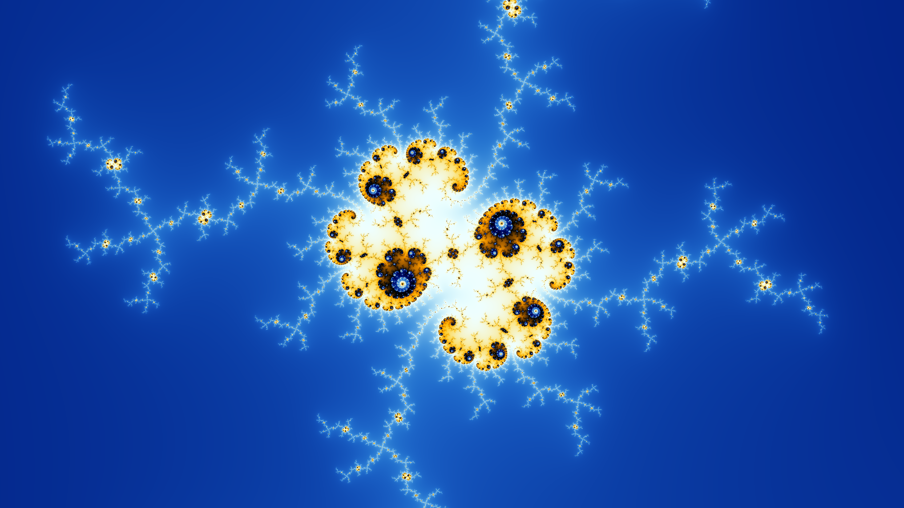

# go-mandelbrot

A Mandelbrot set painter with arbitrary precision.


# Installation

```sh
go get -u github.com/zzag/go-mandelbrot
```


# Usage

```
  -bailout float
        bailout (default 64)
  -centerx string
        x coordinate of the center of the zoom area (default "0.0")
  -centery string
        y coordinate of the center of the zoom area (default "0.0")
  -h int
        height of the viewport (default 720)
  -iters int
        maximum number of iterations per pixel (default 1024)
  -out string
        file where output is stored (default "out.png")
  -prec uint
        computation precision (default 128)
  -scale float
        palette scale (default 256)
  -shift float
        palette shift
  -w int
        width of the viewport (default 1280)
  -zoom string
        zoom level (default "0.256")
```


# Zoom

`centerx`: `-1.7400623825793399052208441670658256382966417204361718668798624184611`, `centery`: `0.02817533977921104899241152114431950968753907674299060857040130959588`, `zoom`: `2e60` (on my old laptop it took ~5 hours):


`centerx`: `0.3602404434376143632361252444495453084826078`, `centery`: `-0.641313061064803174860375015179302066579494`, `zoom`: `2e3`:


`centerx`: `0.3602404434376143632361252444495453084826078`, `centery`: `-0.641313061064803174860375015179302066579494`, `zoom`: `2e5`:

